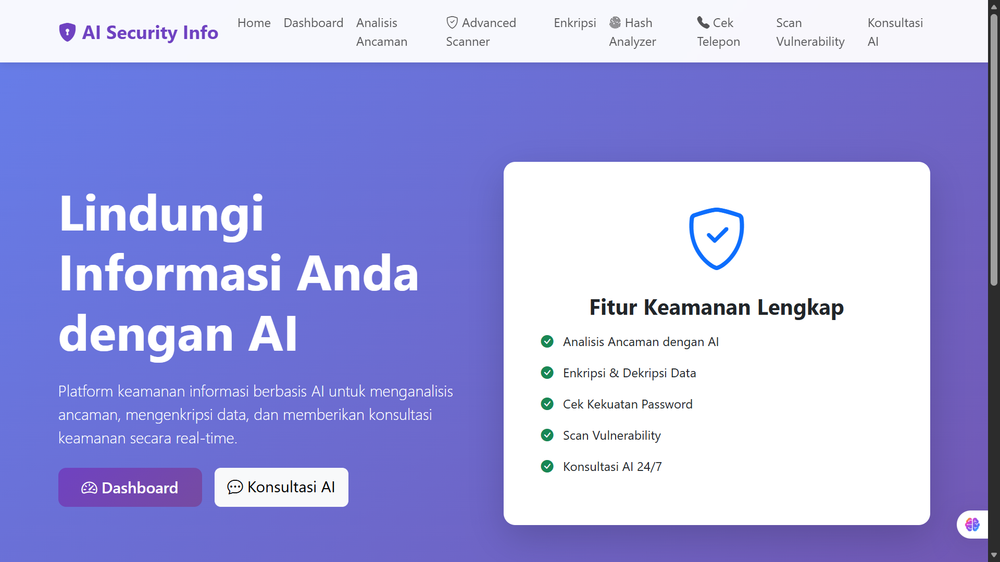
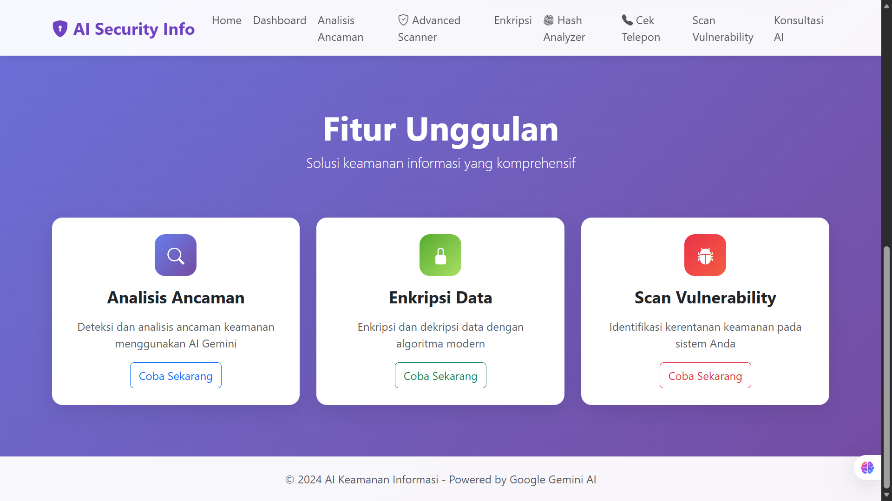
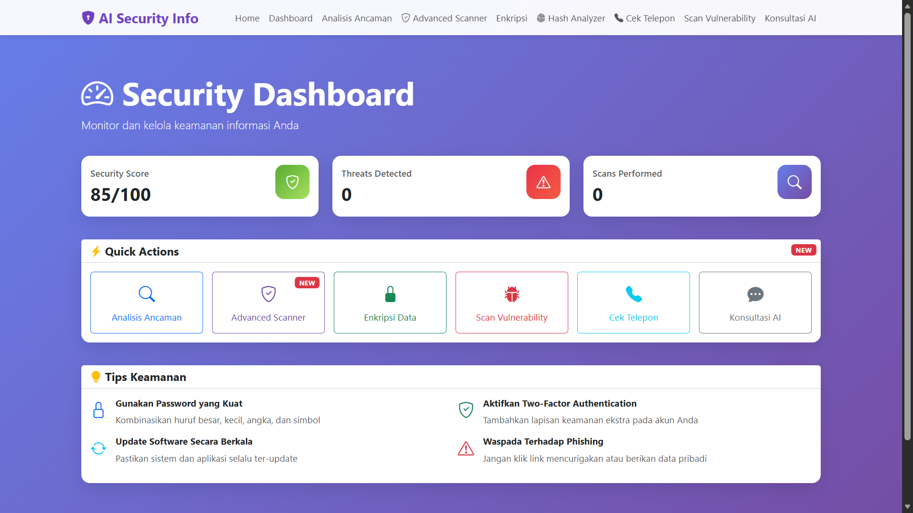
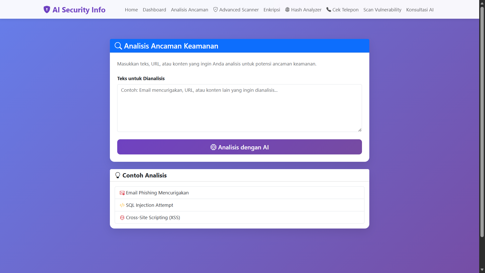
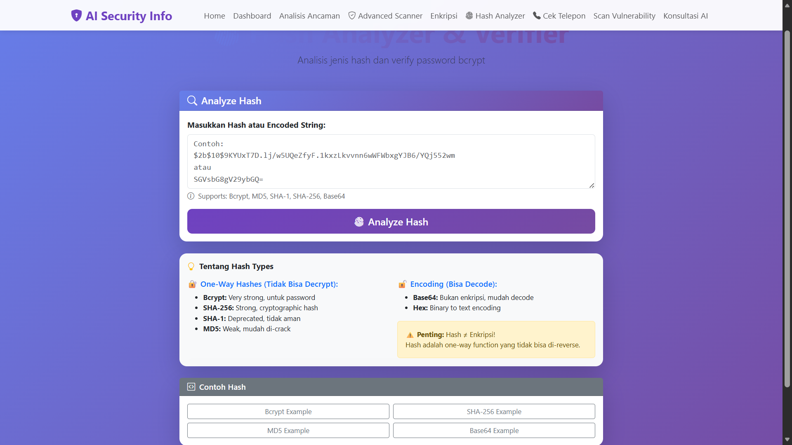
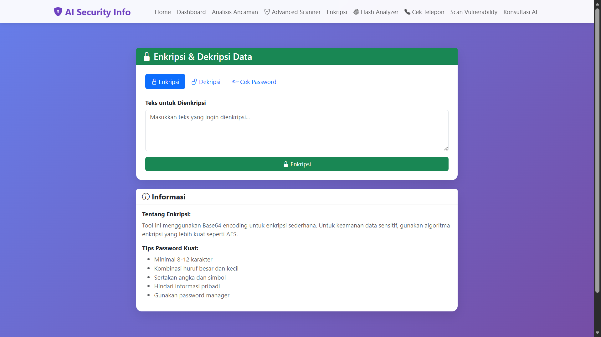
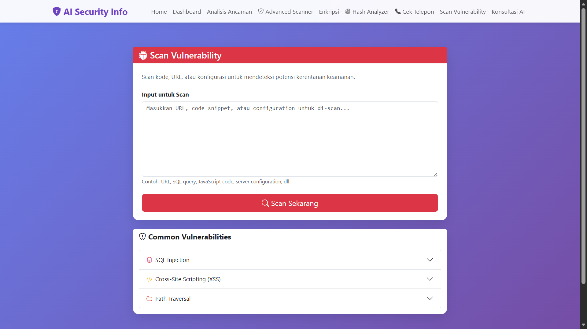
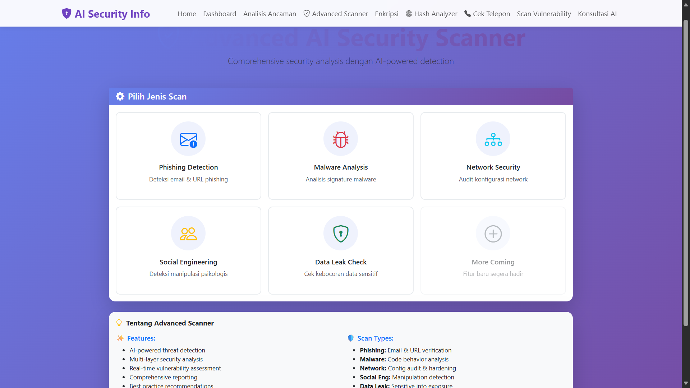
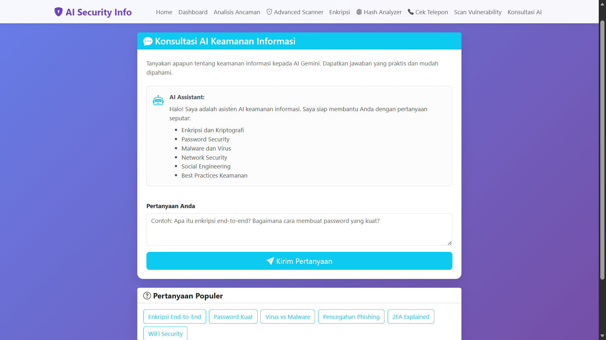
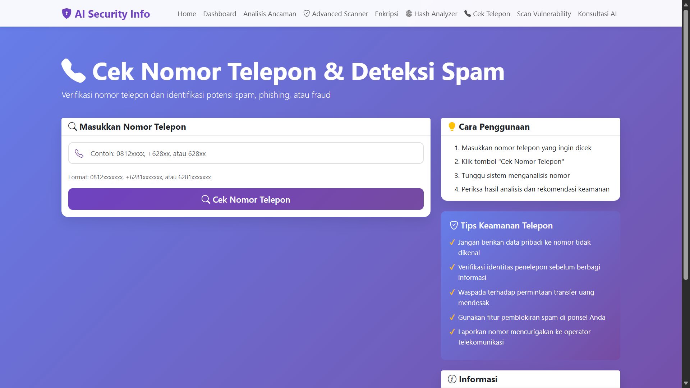

# AI Information Security (AI Keamanan Informasi)

[](https://www.python.org/)
[](https://flask.palletsprojects.com/)
[](https://getbootstrap.com/)
[](#)
[](#license)

An AI-powered information security web platform using **Google Gemini** to analyze threats, perform simple encryption/decryption, check password strength, scan common vulnerability patterns, and provide security consultation.

> ⚠️ **Disclaimer**: This project is built for learning and educational purposes. It does not replace professional security testing, secure SDLC practices, or production-grade security controls.

## ✨ Key Features

- ✅ **Threat Analysis**: Detect and analyze suspicious content using AI
- ✅ **Data Encryption**: Encode/decode data using Base64
- ✅ **Password Check**: Evaluate password strength and quality
- ✅ **Vulnerability Scan**: Identify common security patterns (SQLi, XSS, etc.)
- ✅ **AI Consultation**: Ask questions and get AI-assisted security guidance

## 🧰 Tech Stack

- **Backend**: Flask (Python)
- **Frontend**: Bootstrap 5, Bootstrap Icons
- **AI**: Google Gemini
- **Architecture**: MVC (Model–View–Controller)

## ✅ Requirements

- Python **3.8+**
- Google Gemini API Key

## 📦 Installation

### 1) Clone the Repository

````bash
git clone https://github.com/sayyidoliem/aikeamananinformasi.git
cd aikeamananinformasi

### 2) Create & Activate Virtual Environment (Recommended)

**Windows**

```bash
python -m venv venv
venv\Scripts\activate
````

**macOS/Linux**

```bash
python -m venv venv
source venv/bin/activate
```

### 3) Install Dependencies

```bash
pip install -r requirements.txt
```

## 🔑 Environment Variables

### Create `.env` from `.env.example`

**macOS/Linux**

```bash
cp .env.example .env
```

**Windows (Command Prompt)**

```bat
copy .env.example .env
```

Then edit `.env` and fill in your real values (especially `GEMINI_API_KEY` and `SECRET_KEY`).

### ✅ `.env.example` (safe to commit)

Create a file named `.env.example` in the project root:

```env
# Gemini AI Configuration
GEMINI_API_KEY=your_gemini_api_key_here

# Flask Configuration
FLASK_APP=app.py
FLASK_ENV=development
SECRET_KEY=change-this-secret-key-in-production

# Database Configuration (optional)
DATABASE_URL=sqlite:///security_info.db
```

### 🔒 Security Notes for Secrets

- **Never commit** `.env` to GitHub.
- Ensure `.env` is listed in `.gitignore`.
- Rotate/revoke leaked keys immediately.

## 🚀 Running the App

```bash
python app.py
```

Open:

- **<http://127.0.0.1:5000>**

## 🗂️ Project Structure

```
aikeamananinformasi/
├── app.py                      # Application entry point
├── config.py                   # App configuration (.env loading, settings)
├── routes.py                   # Application routes (Blueprints/endpoints)
├── requirements.txt            # Python dependencies
├── .env                        # Environment variables (DO NOT COMMIT)
├── .env.example                # Example env file (SAFE TO COMMIT)
├── .gitignore                  # Git ignore rules
├── models/                     # Models (Data layer)
│   ├── __init__.py
│   └── security_model.py       # Security operations (hashing/encrypt/etc.)
├── controllers/                # Controllers (Business logic)
│   ├── __init__.py
│   └── security_controller.py  # Main controller + Gemini integration
└── templates/                  # Views (Bootstrap UI)
    ├── base.html               # Base layout
    ├── index.html              # Homepage
    ├── dashboard.html          # Dashboard
    ├── analyze.html            # Threat analysis
    ├── encrypt.html            # Encryption/decryption
    ├── vulnerability_scan.html # Vulnerability scan
    ├── ai_consultation.html    # AI consultation
    ├── 404.html                # Error 404 page
    └── 500.html                # Error 500 page
```

## 🧭 How It Works (MVC Overview)

### Models (`models/security_model.py`)

- Handles security-related operations and data logic:
  - Password hashing
  - Base64 encode/decode
  - Password strength analysis

### Controllers (`controllers/security_controller.py`)

- Business logic layer:
  - Integrates Gemini AI
  - Connects models to views
  - Handles processing and response formatting

### Views (`templates/`)

- UI using Bootstrap 5:
  - Responsive layout
  - Forms and pages for each feature

### Routes (`routes.py`)

- Defines endpoints for each feature:
  - Maps requests to controllers
  - Organizes navigation across pages

## 🧪 Usage Guide

1. **Dashboard**  
   View general overview, tips, and quick navigation.

2. **Threat Analysis**  
   Paste suspicious email/text and get AI analysis + recommendations.

3. **Encryption / Decryption**  
   Encode or decode data using Base64.

4. **Vulnerability Scan**  
   Scan code snippets or patterns to detect common vulnerability indicators (SQLi/XSS).

5. **AI Consultation**  
   Ask questions about security and get AI guidance.

## 🖼️ UI Screenshots

> All screenshots are stored under `docs/image/`.  
> If you rename or move files, update the paths below.

### Home




### Dashboard



### Threat Analyzer



### Hash / Analyzer



### Encryption / Decryption



### Vulnerability Scanner




### AI Consultation



### Phone Number Check



## ☁️ Deployment

### A) Deploy to Vercel (Optional)

Vercel can run Flask using the **Python Runtime**. For Flask apps, Vercel expects a module-level Flask instance named `app` in a supported entrypoint file.

#### Recommended Setup (for full Flask web apps)

1. Create `api/index.py`:

```python
from app import create_app

app = create_app()
```

2. Add `vercel.json` in the project root (rewrite all routes to Flask):

```json
{
  "rewrites": [{ "source": "/(.*)", "destination": "/api/index.py" }]
}
```

3. In the Vercel Dashboard:

- Import your GitHub repo
- Set **Environment Variables**:
  - `GEMINI_API_KEY`
  - `SECRET_KEY`
  - `DATABASE_URL` (optional)
- Deploy

> Tip: In serverless environments, avoid relying on local disk persistence. Prefer stateless behavior.

### B) Deploy to a Traditional Server (Example)

Using Gunicorn (Linux/VM):

```bash
pip install gunicorn
gunicorn app:app
```

> If your app uses a factory pattern only, ensure `app` is exposed at module level or configure Gunicorn accordingly.

## 🔐 Security

- Store API keys in `.env` only (never commit secrets)
- Use HTTPS in production
- Validate and sanitize user inputs
- Keep dependencies updated

## 🧰 Troubleshooting

### 1) `ModuleNotFoundError: No module named ...`

- Activate the virtual environment
- Reinstall dependencies:

```bash
pip install -r requirements.txt
```

### 2) AI Feature Not Working / Invalid API Key

- Check `.env` exists and contains:

```env
GEMINI_API_KEY=...
```

- Restart the app after editing `.env`

### 3) Static files not loading (CSS/JS)

- Ensure templates reference correct paths
- For serverless hosting, consider a dedicated static hosting folder if needed

### 4) Flask Debug Mode in Production

- Do not deploy with `debug=True` in production.

## 🗺️ Roadmap (Ideas)

- [ ] Authentication & role-based access
- [ ] Export reports (PDF/JSON)
- [ ] Stronger vulnerability ruleset
- [ ] Logging & rate limiting
- [ ] Unit tests + CI pipeline (GitHub Actions)

## 🤝 Contributing

Contributions are welcome!

1. Fork this repository
2. Create a branch:
   ```bash
   git checkout -b feature/my-feature
   ```
3. Commit changes:
   ```bash
   git commit -m "Add: my feature"
   ```
4. Push:
   ```bash
   git push origin feature/my-feature
   ```
5. Open a Pull Request

## 📄 License

This project is created for learning purposes.

## 👨‍💻 Author

Developed with ❤️ using Flask and Google Gemini AI.

## ⚠️ IMPORTANT

- Never share your API key publicly
- Use HTTPS for production
- Update dependencies regularly for security
